# 🏥 Clinic Booking System

A full-stack **ASP.NET Core 8 MVC** web application for managing clinic appointments. Patients can browse doctors by specialty, check real-time available slots, and book/cancel/reschedule appointments. Admins manage doctors, working hours, and users through a dedicated dashboard.

---

## 📸 Screenshots

### Guest Home — Sign In or Register
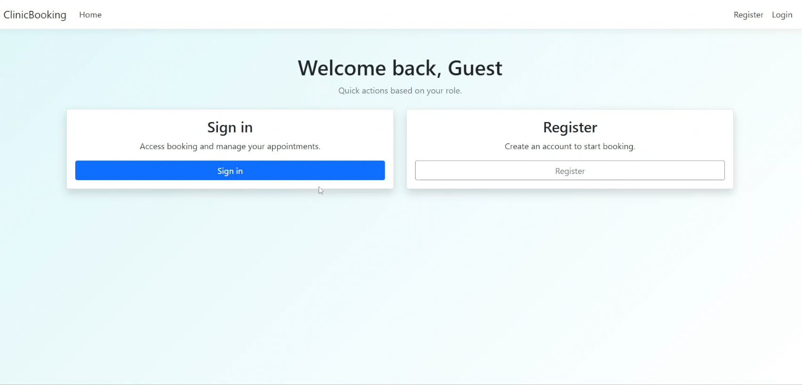

### Login — Patient


### Login — Doctor


### Login — Admin
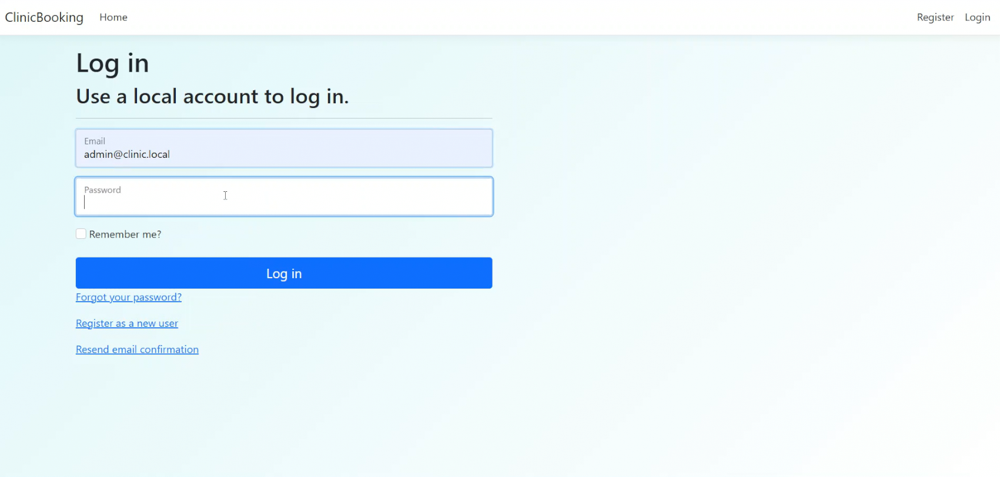

### Patient Home — Quick Actions Dashboard
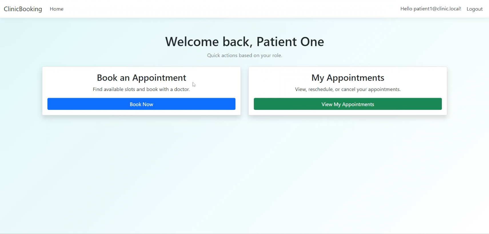

### Book an Appointment — Real-Time Slot Picker (AJAX)
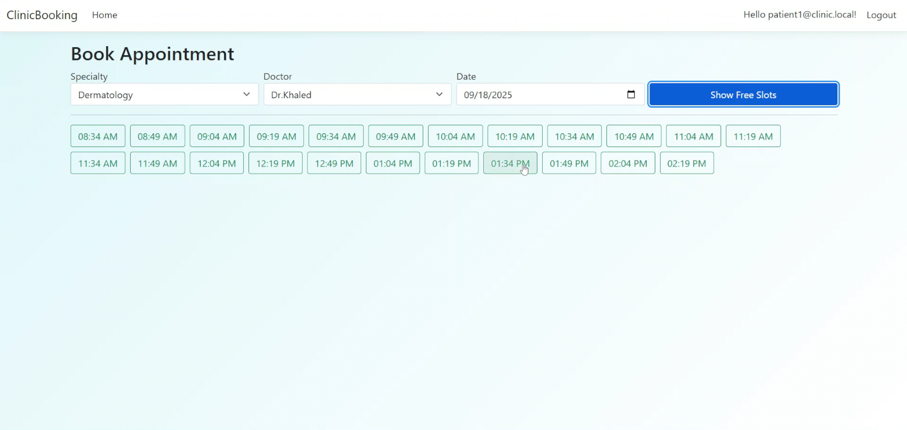

### My Appointments — View, Cancel & Reschedule
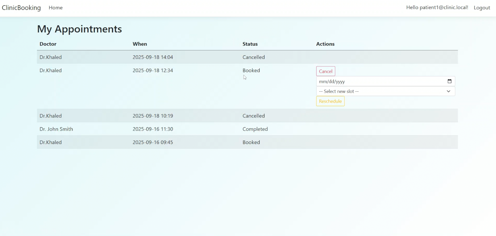

### Doctor Home — Access Today's Schedule
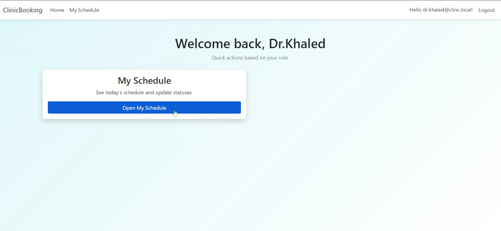

### Doctor Schedule — Today's Appointments with Status Actions
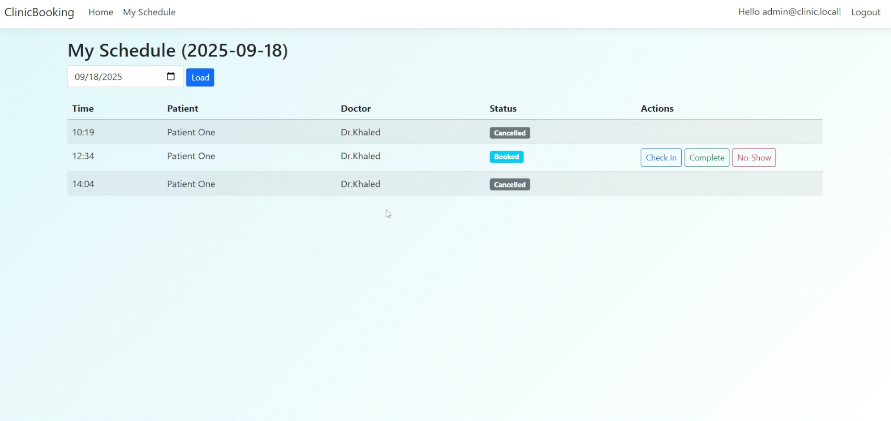

### Admin — Manage Specialties
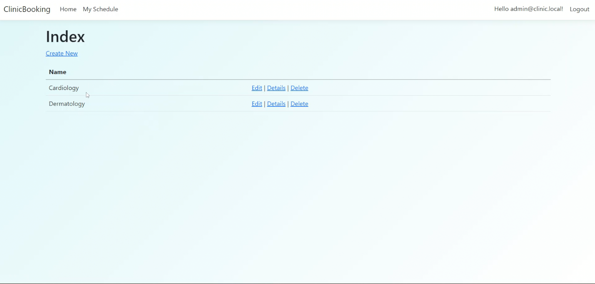

### Admin — Doctors List
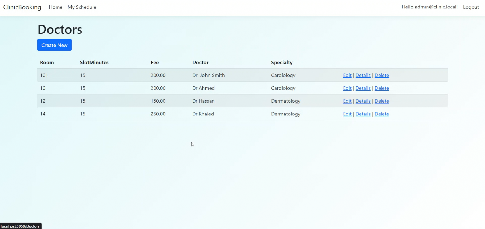

### Admin — Create Doctor with Working Hours
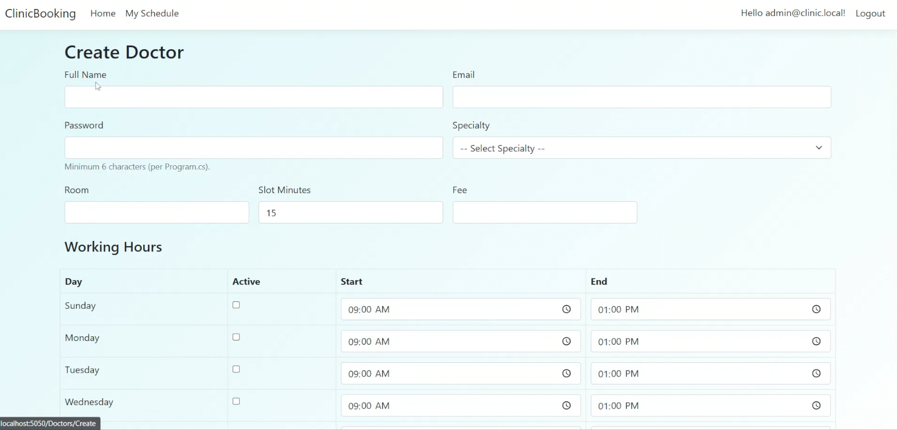

### Admin — Manage Working Hours (All Doctors)
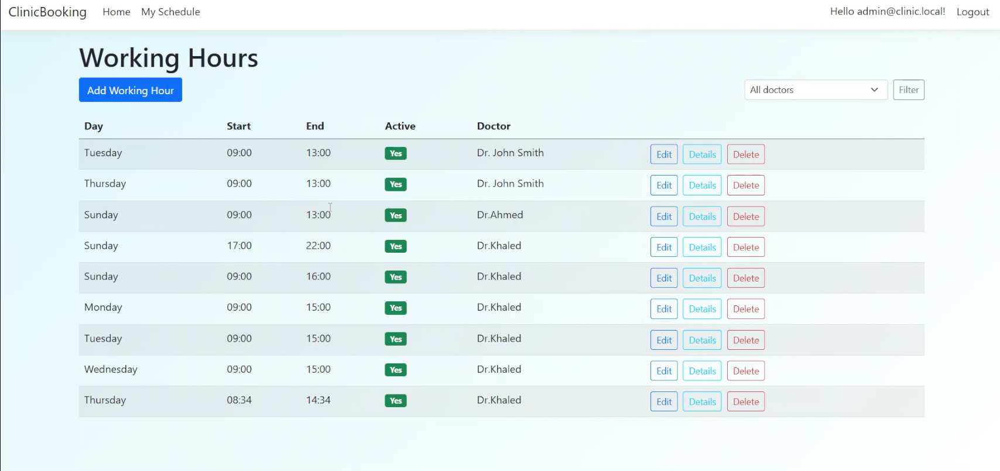

### Admin — Add Working Hour
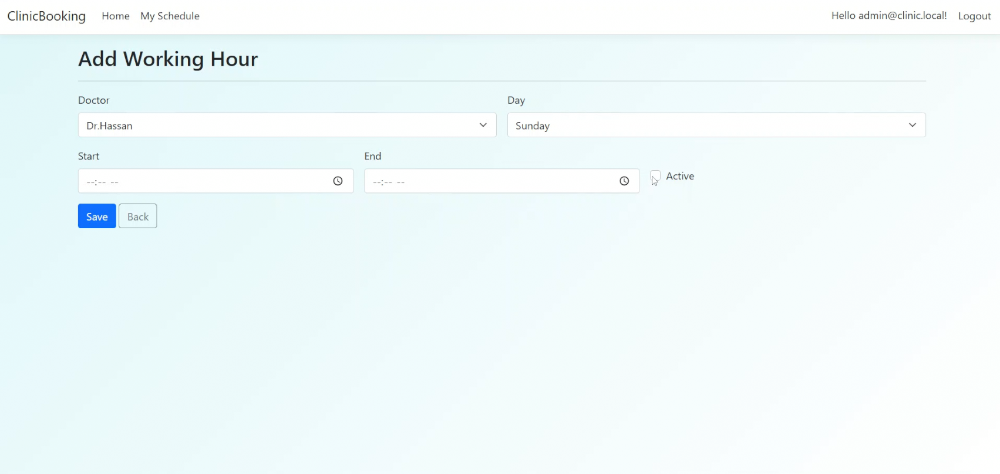

### Admin — Working Hours (Filtered by Doctor)
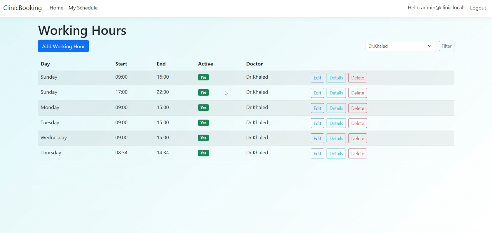

### Admin — User Management (Promote / Demote)
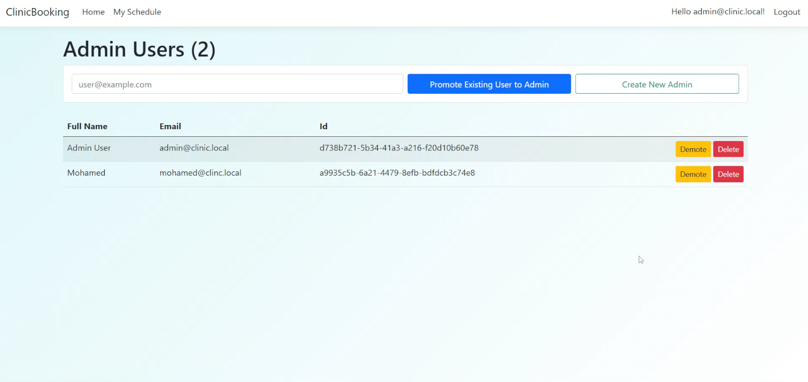

---

## ✨ Features

### Patient
- Browse doctors filtered by medical specialty
- View real-time free appointment slots (AJAX, no page reload)
- Book, cancel, and reschedule appointments
- 1-hour lockout window — cannot cancel/reschedule too close to the appointment time

### Doctor
- View today's scheduled appointments dashboard
- Check In / Complete / No-Show status actions per appointment

### Admin
- Full CRUD for Doctors, Specialties, and Users
- Set doctor working hours per day of the week (with configurable slot durations)
- Promote/demote users to Admin role

### System
- **Race-condition-safe booking** using `IsolationLevel.Serializable` DB transactions + filtered unique index on `(DoctorId, StartDateTime)` — prevents double-booking even under concurrent requests
- UTC storage with local-time UI conversion
- ASP.NET Identity with role-based authorization (Admin / Doctor / Patient)
- Seeded demo data on first run

---

## 🛠️ Tech Stack

| Layer | Technology |
|---|---|
| Backend | ASP.NET Core 8 MVC (C#) |
| ORM | Entity Framework Core 8 |
| Database | SQL Server / SQL Server Express |
| Auth | ASP.NET Core Identity |
| Frontend | Razor Views, Bootstrap 5, jQuery |

---

## 🚀 Getting Started

### Prerequisites
- [.NET 8 SDK](https://dotnet.microsoft.com/download/dotnet/8.0)
- SQL Server or SQL Server Express

### Setup

1. **Clone the repository**
   ```bash
   git clone https://github.com/yrabie21/ClinicBooking.git
   cd ClinicBooking
   ```

2. **Configure the database connection**

   Copy the example config and fill in your SQL Server name:
   ```bash
   cp ClinicBooking/appsettings.example.json ClinicBooking/appsettings.json
   ```
   Then edit `appsettings.json`:
   ```json
   "DefaultConnection": "Server=YOUR_SERVER_NAME\\SQLEXPRESS;Database=ClinicBookingDb;Trusted_Connection=True;TrustServerCertificate=True"
   ```

3. **Apply database migrations**
   ```bash
   cd ClinicBooking
   dotnet ef database update
   ```

4. **Run the application**
   ```bash
   dotnet run
   ```
   The app seeds demo users automatically on first startup.

### Demo Accounts (seeded on first run)

| Role | Email | Password |
|---|---|---|
| Admin | admin@clinic.local | Pass123! |
| Doctor | dr.smith@clinic.local | Pass123! |
| Patient | patient1@clinic.local | Pass123! |

---

## 📁 Project Structure

```
ClinicBooking/
├── Controllers/          # MVC controllers (Appointments, Doctors, Admin, etc.)
├── Models/               # Domain entities (Doctor, Appointment, Patient, ...)
├── ViewModels/           # Form/view-specific models
├── Services/             # Business logic (BookingService, ScheduleService)
├── Data/
│   ├── ApplicationDbContext.cs   # EF Core DbContext + model configuration
│   └── Migrations/               # EF Core migration history
├── Views/                # Razor views per controller
├── Areas/Identity/       # Customized Identity login/register pages
└── wwwroot/              # Static assets (CSS, JS, Bootstrap)
```

---

## 🔐 Security Notes

- Credentials are **never** stored in source control. Use `appsettings.json` (gitignored) locally.
- All booking and admin endpoints require authentication via `[Authorize]` / `[Authorize(Roles="Admin")]`.
- Anti-forgery tokens are enforced on all POST actions.

---

## 📄 License

This project is open source and available under the [MIT License](LICENSE).
